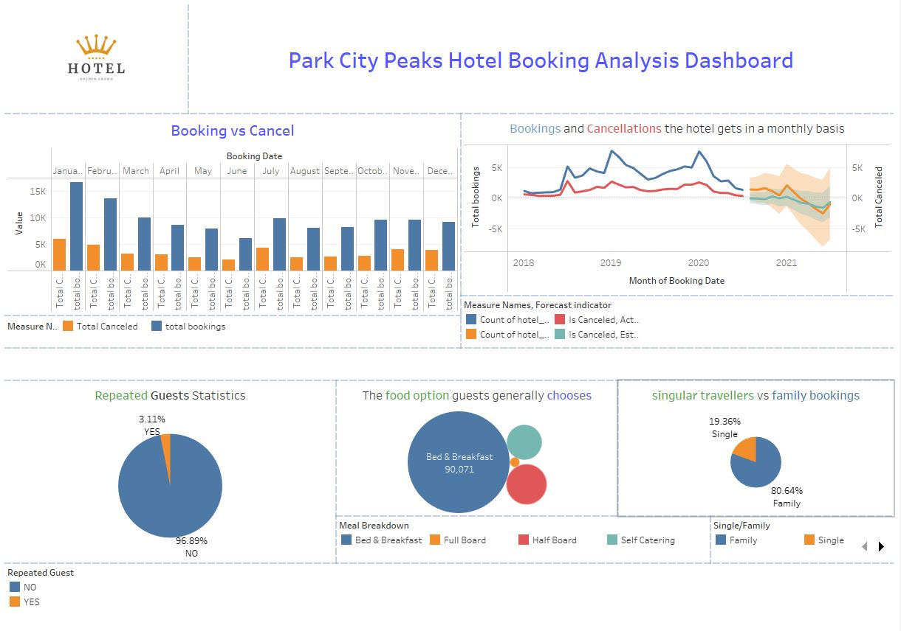

# Park City Peaks Hotel Booking Dashboard

#### Project Overview:
Welcome to the Park City Peaks Hotel Booking Dashboard project! This project aims to provide a comprehensive visualization tool for managing hotel bookings efficiently. Whether you're a hotel manager, staff member, or simply interested in exploring hotel booking trends, this dashboard offers valuable insights into booking data.

#### Senario
At the moment, the hotel manager can get an excel spreadsheet that he downloads from the Hotel Booking system.

He has given us the spreadsheet and would like to see the following:

##### 1. Bookings and Cancellations the hotel gets in a monthly basis
##### 2. Repeated Guests Statistics
##### 3. The food option guests generally chooses
##### 4. Do they get singular travellers or family bookings on average?

Here is the Dashboard link: https://public.tableau.com/views/ParkCityPeaksHotelBookings_17143033533110/Dashboard1?:language=en-US&:sid=&:display_count=n&:origin=viz_share_link

